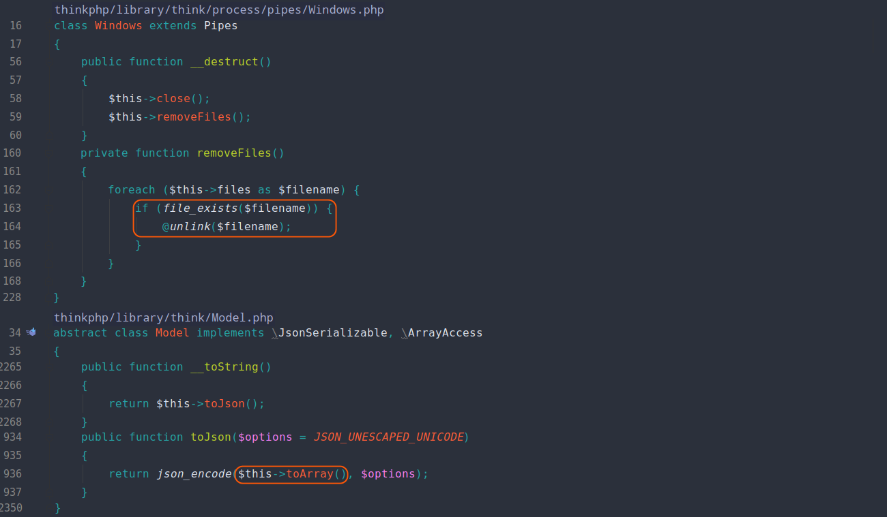
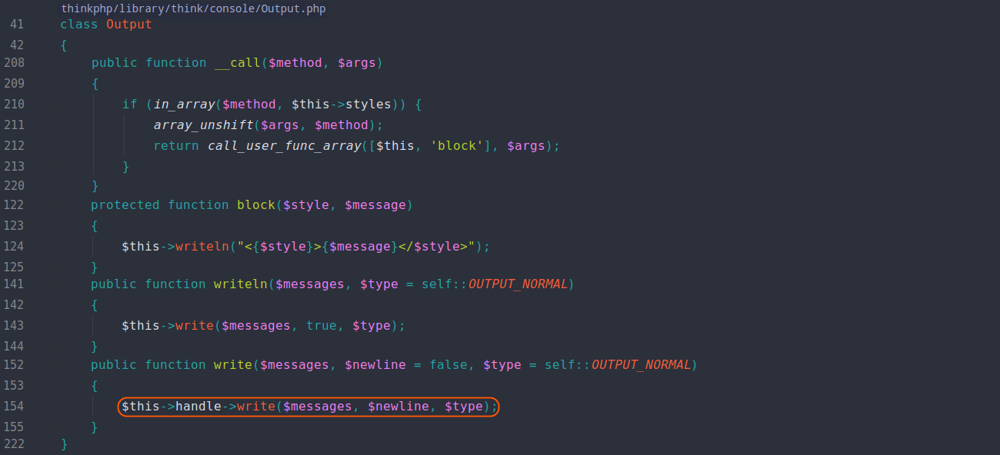
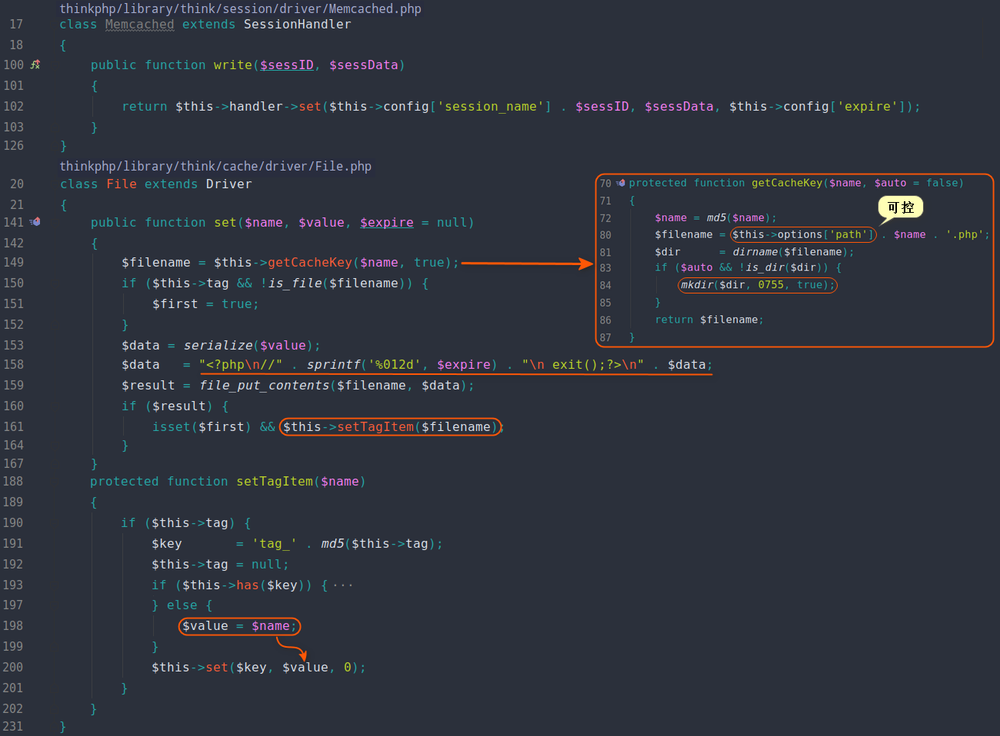
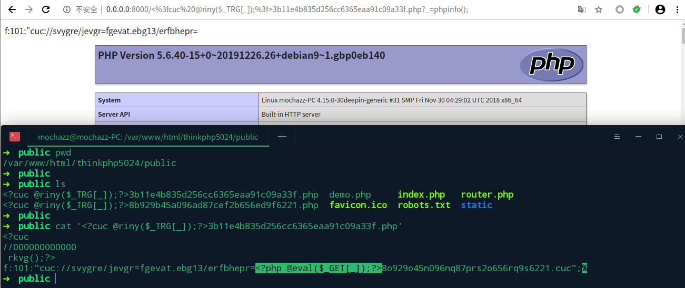
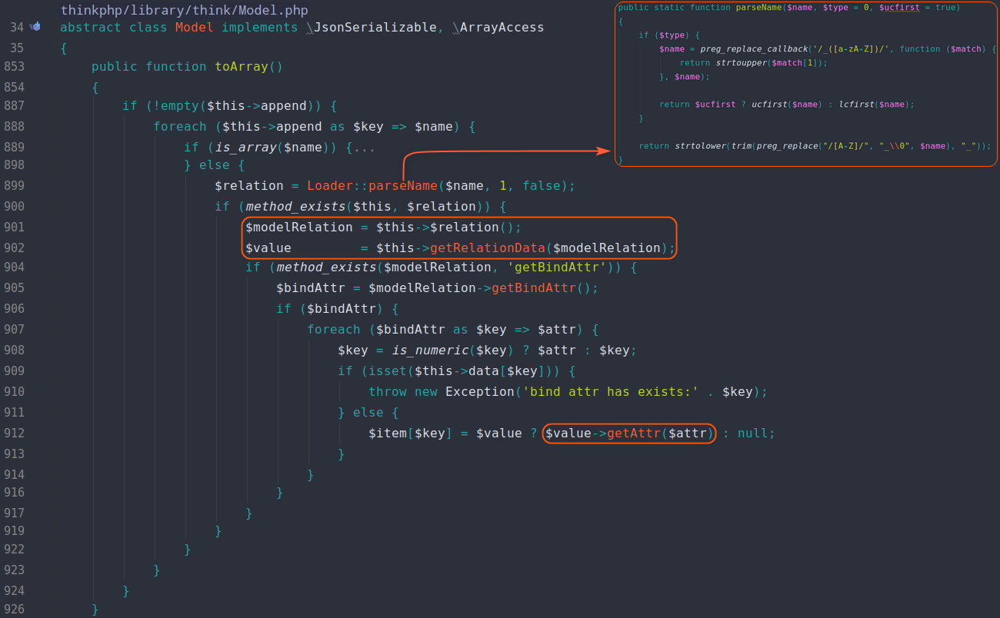
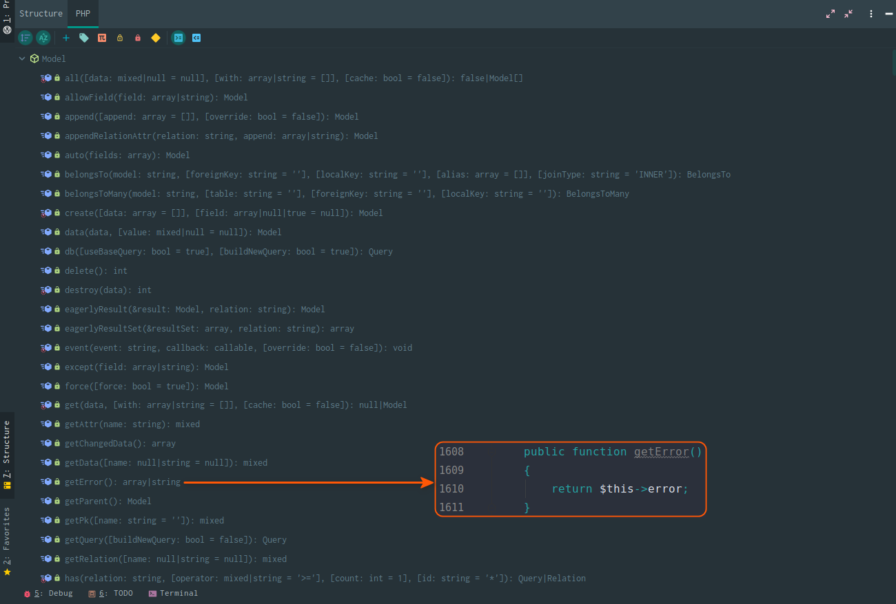
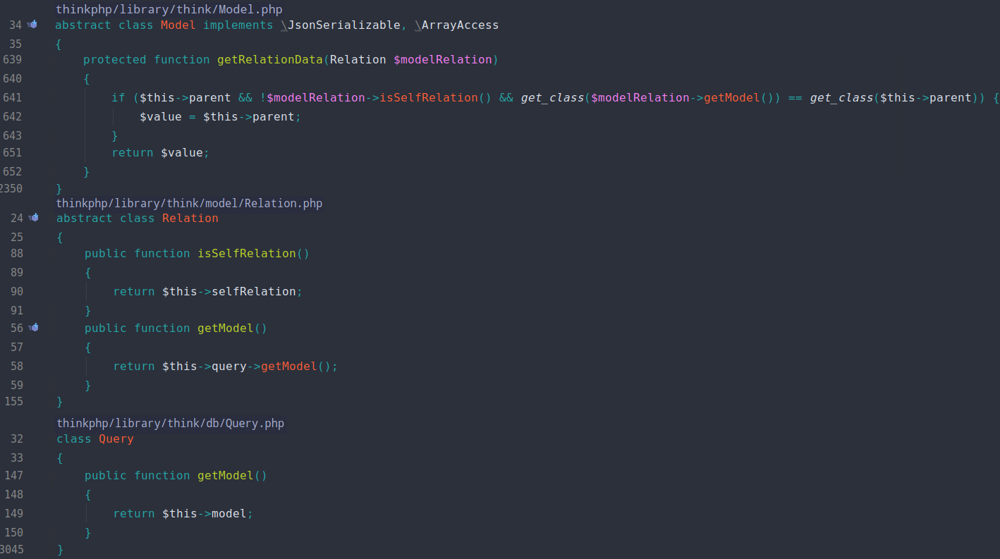
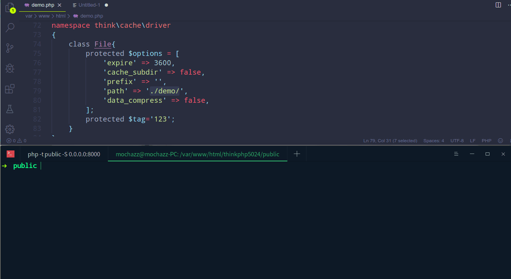

本系列文章将针对 **ThinkPHP** 的历史漏洞进行分析，今后爆出的所有 **ThinkPHP** 漏洞分析，也将更新于 [ThinkPHP-Vuln](https://github.com/Mochazz/ThinkPHP-Vuln) 项目上。本篇文章，将分析存在于 **ThinkPHP 5.0.X** 中的反序列化利用链。

## 漏洞环境

漏洞测试环境：PHP5.6+Linux+ThinkPHP5.0.24

漏洞测试代码 **application/index/controller/Index.php** 。

```php
<?php
namespace app\index\controller;

class Index
{
    public function index()
    {
        $c = unserialize($_GET['c']);
        var_dump($c);
        return 'Welcome to thinkphp5.0.24';
    }
}
```

## 漏洞分析

**POP** 链入口点为 **think\process\pipes:__destruct** 方法。通过 **__destruct** 方法里调用的 **removeFiles** 方法，可以利用 **file_exists** 函数来触发任意类的 **__toString** 方法，这里我们选择 **think\Model** 类来触发。由于该类为抽象类，所以我们后续在构造 **EXP** 的时候得使用其子类，例如： **think\Model\Pivot** 类。



在先前的 **ThinkPHP5.1.X** 反序列化链中，都是在调用 **think\Model:toArray()** 时触发 **think\Request:__call()** 。然而 **ThinkPHP5.0.X** 中的 **think\Request:__call()** 写法与 **ThinkPHP5.1.X** 的不一样了，且成员变量不可控。


所以我们需要找其他可利用的 **__call** 方法，这里我们选择 **think\console\Output** 类。其 **__call** 方法最终会调用到 **$this->handle->write()** ，而这个 **$this->handle** 可以，所以思路就是找一个类的 **write** 方法可以实现写文件。



这里，我们将 **think\console\Output** 类的 **handler** 属性设置成 **think\session\driver\Memcached** 类对象。因为我们发现 **think\cache\driver\File:set()** 方法可以写文件，刚好 **think\session\driver\Memcached:write()** 中调用了 **set** 方法，且又有一个可控的 **handler** 属性。我们继续深入，看看如何利用 **think\cache\driver\File:set()** 方法写文件。

首先， **$filename** 的前一部分 **$this->options['path']** 可控，但是这时的 **$value=true** ，其在 **think\console\Output:writeln()** 方法中固定为 **true** ，也就是说下图第158行写入文件的代码我们不可控。但是我们继续往下看，发现 **$this->setTagItem($filename)** 中又调用了 **set** 方法写文件，而此时传入的 **$value** 为我们部分可控的 **$filename** 。那么此时，我们就可以使用 **PHP** 的伪协议来写 **shell** 。



例如，我们将部分可控的 **$this->options['path']** 设置成 **php://filter/write=string.rot13/resource=\<?cuc @riny($_TRG[\_]);?>** ，最后就会生成一个一句话木马（访问 **webshell** 的时候，注意要将文件名中的 **?** 号 **URL编码** 成 **%3f** ）。



后面的利用基本讲完了，我们再回到刚刚的 **think\Model:toArray()** ，因为我们还没说明选择何处调用 **__call** 方法。这里我们选择通过下图第912行的 **$value->getAttr()** ，来触发 **think\console\Output:__call()** 方法。



那么这里的 **$value** 一定是 **think\console\Output** 类对象，其在上图第902行 **$this->getRelationData($modelRelation)** 被赋值。其中，参数 **$modelRelation = $this->$relation()** ，实际上就是 **think\Model** 类任意方法的返回结果。这里我选择返回结果简单可控的 **getError** 方法。



参数已经可控了，接下来我们就直接看 **think\Model:getRelationData()** 的具体代码。下图的 **$this->parent** 肯定是 **think\console\Output** 类对象，所以我们只需要满足下面的 **if** 语句即可。这里我们 **think\model\Relation** 类的 **isSelfRelation、getModel** 方法返回值都可控，所以我们找 **think\model\Relation** 的子类套一下即可。



万一网站不允许写文件，我们可以稍微修改下 **payload** 用于创建一个 **0755** 权限的目录（这里利用的是 **think\cache\driver\File:getCacheKey()** 中的 **mkdir** 函数），然后再往这个目录写文件。



最终生成 **shell** 的 **EXP** 如下：

```
已删除
```