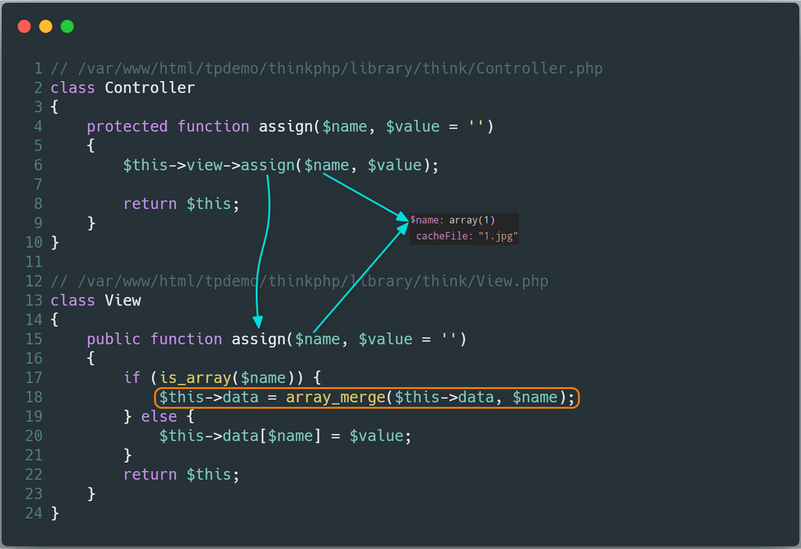
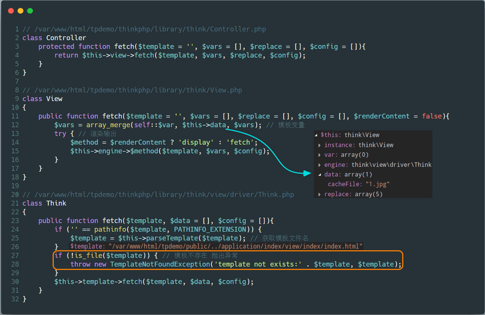
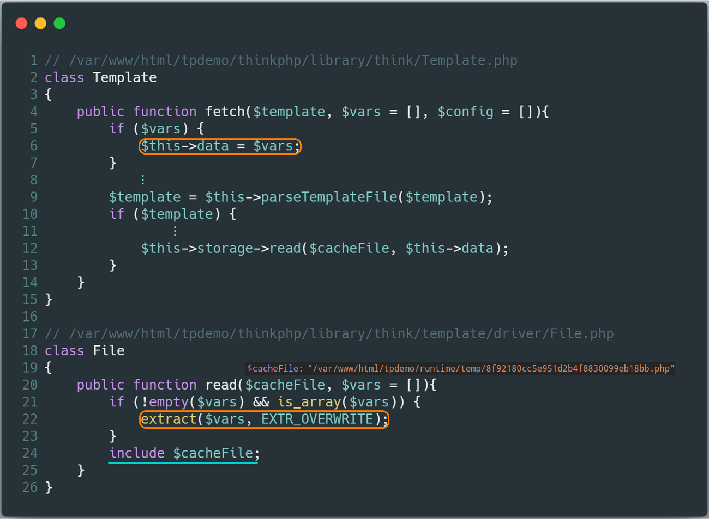
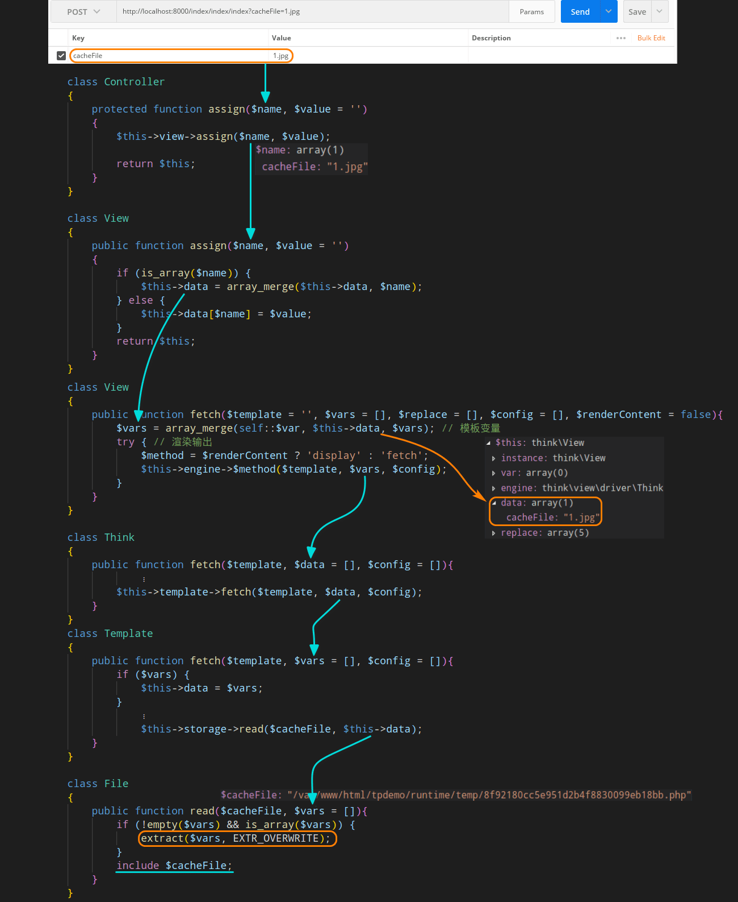

本系列文章将针对 **ThinkPHP** 的历史漏洞进行分析，今后爆出的所有 **ThinkPHP** 漏洞分析，也将更新于 [ThinkPHP-Vuln](https://github.com/Mochazz/ThinkPHP-Vuln) 项目上。本篇文章，将分析 **ThinkPHP** 中存在的 **文件包含漏洞** 。

## 漏洞概要

本次漏洞存在于 **ThinkPHP** 模板引擎中，在加载模版解析变量时存在变量覆盖问题，而且程序没有对数据进行很好的过滤，最终导致 **文件包含漏洞** 的产生。漏洞影响版本： **5.0.0<=ThinkPHP5<=5.0.18** 、**5.1.0<=ThinkPHP<=5.1.10**。

## 漏洞环境

通过以下命令获取测试环境代码：

```bash
composer create-project --prefer-dist topthink/think=5.0.18 tpdemo
```

将 **composer.json** 文件的 **require** 字段设置成如下：

```json
"require": {
    "php": ">=5.6.0",
    "topthink/framework": "5.0.18"
},
```

然后执行 `composer update` ，并将 **application/index/controller/Index.php** 文件代码设置如下：

```php
<?php
namespace app\index\controller;
use think\Controller;
class Index extends Controller
{
    public function index()
    {
        $this->assign(request()->get());
        return $this->fetch(); // 当前模块/默认视图目录/当前控制器（小写）/当前操作（小写）.html
    }
}
```

创建 **application/index/view/index/index.html** 文件，内容随意（没有这个模板文件的话，在渲染时程序会报错），并将图片马 **1.jpg** 放至 **public** 目录下（模拟上传图片操作）。接着访问 **http://localhost:8000/index/index/index?cacheFile=demo.php** 链接，即可触发 **文件包含漏洞** 。


## 漏洞分析

首先在官方发布的 **5.0.19** 版本更新说明中，发现其中提到该版本包含了一个安全更新。


我们可以查阅其 **commit** 记录，发现其改进了模板引擎，其中存在危险函数 **extract** ，有可能引发变量覆盖漏洞。接下来，我们直接跟进代码一探究竟。


首先，用户可控数据未经过滤，直接通过 **Controller** 类的 **assign** 方法进行模板变量赋值，并将可控数据存在 **think\View** 类的 **data** 属性中。



接着，程序开始调用 **fetch** 方法加载模板输出。这里如果我们没有指定模板名称，其会使用默认的文件作为模板，模板路径类似 **当前模块/默认视图目录/当前控制器（小写）/当前操作（小写）.html** ，如果默认路径模板不存在，程序就会报错。



我们跟进到 **Template** 类的 **fetch** 方法，可以发现可控变量 **$vars** 赋值给 **$this->data** 并最终传入 **File** 类的 **read** 方法。而 **read** 方法中在使用了 **extract** 函数后，直接包含了 **$cacheFile** 变量。这里就是漏洞发生的关键原因（可以通过 **extract** 函数，直接覆盖 **$cacheFile** 变量，因为 **extract** 函数中的参数 **$vars** 可以由用户控制）。



## 漏洞修复

官方的修复方法是：先将 **$cacheFile** 变量存储在 **$this->cacheFile** 中，在使用 **extract** 函数后，最终 **include** 的变量是 **$this->cacheFile** ，这样也就避免了 **include** 被覆盖后的变量值。


## 攻击总结

最后，再通过一张攻击流程图来回顾整个攻击过程。

